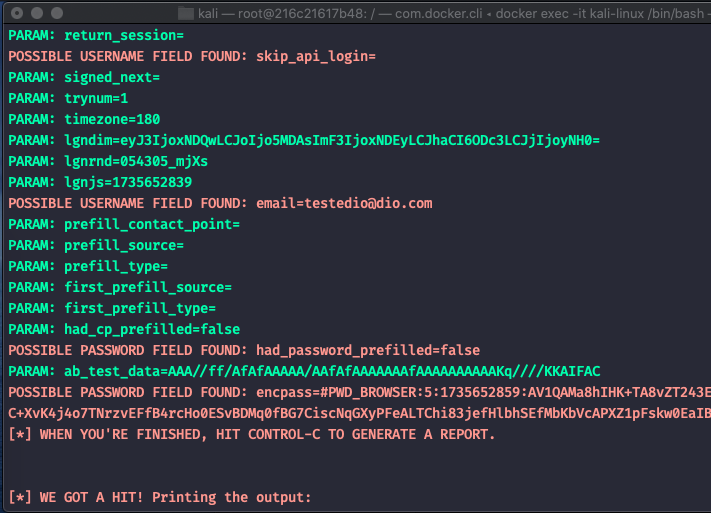

# Phishing para captura de senhas do Facebook

### Ferramentas

- Docker
- Kali Linux
- setoolkit

### Configuações do docker

Obs. Por problemas técnicos não pude instalar o Kali Linux no VirtualBox, contornei o problema gerando o container dele, segue os passos:

Arquivos: 
  - Dockerfile
  - docker-compose.yml

Conteudo do docker-compose.yml:
```
FROM kalilinux/kali-rolling

RUN apt update && apt upgrade -y && apt install set -y

CMD ["/bin/bash"]
```

 Conteudo do docker-compose.yml:
```
version: '3.9'

services:
  kali-linux:
    build:
      context: .
      dockerfile: Dockerfile
    container_name: kali-linux
    ports:
      - "80:80" # Porta de exemplo, mude conforme necessário
    networks:
      - web_net
    tty: true
    stdin_open: true

networks:
  web_net:
    driver: bridge
```

### Comando para subir o container
```
docker-compose up -d
```

### Comando para acessa o terminal do container 
```
docker exec -it kali-linux /bin/bash
```

### Configurando o Phishing no Kali Linux

- ~Acesso root: ``` sudo su ```~ o container já sobe como root o usuário padão
- Iniciando o setoolkit: ``` setoolkit ```
- Tipo de ataque: ``` Social-Engineering Attacks ```
- Vetor de ataque: ``` Web Site Attack Vectors ```
- Método de ataque: ```Credential Harvester Attack Method ```
- Método de ataque: ``` Site Cloner ```
- ~Obtendo o endereço da máquina: ``` ifconfig ```~ Só coloca como localhost, 127.0.0.1, ou o ip da maquina onde está rodando o docker pois foi configurado assim no docker
- URL para clone: http://www.facebook.com

### Acesse o browser o endereço: 
- Se for pela mesma máquina: localhost ou 127.0.1
- Se for de outra máquina da rede, o endereço ip/hostname da máquina onde está rodando o docker

### Resutados (na máquina Docker)


